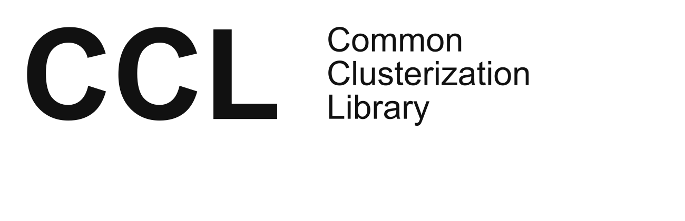

<picture>
  <source media="(prefers-color-scheme: dark)" srcset="img/logo_white.png">
  <source media="(prefers-color-scheme: light)" srcset="img/logo.png">
  
</picture>

[](https://github.com/vkireyeu/ccl/actions/workflows/ci.yml)

## Common Clusterization Library (CCL)

Logical evolution of the [psMST](https://gitlab.com/vkireyeu/psmst) library.

CCL contains:
- MST procedure: pure distance-based with optional inclusion of the momentum space.
- "Box"-like coalescence for light nuclei: d, t, He3, He4, H3L, H4L.
- Simulated Annealing procedure for MST clusters.
- Binding energy calculations for all these methods.

## Build instructions
Configure the build:
```bash
cmake -S . -B build
```
Compile the project:
```bash
cmake --build build -j
```
Run the test suite (optional):
```bash
ctest --test-dir build --output-on-failure
```
Install the library (optional):
```bash
sudo cmake --install build --prefix /usr/local
```

## Other algorithms 
- MST and SACA algorithms used in the [PHQMD](https://phqmd.gitlab.io/) approach:
[Phys. Rev. C 101, 044905](https://journals.aps.org/prc/abstract/10.1103/PhysRevC.101.044905), 
[arxiv:1907.03860](https://arxiv.org/abs/1907.03860)

- Fragment Recognition In General Application (FRIGA): 
[Phys. Rev. C 100, 034904](https://journals.aps.org/prc/abstract/10.1103/PhysRevC.100.034904), 
[arxiv:1906.06162](https://arxiv.org/abs/1906.06162)

- Coalescence (in [UrQMD](https://itp.uni-frankfurt.de/~bleicher/index.html?content=urqmd) approach): [Phys.Rev.C 99 (2019) 1, 014901](https://doi.org/10.1103/PhysRevC.99.014901), [Phys.Rev.C 107 (2023) 1, 014912](https://doi.org/10.1103/PhysRevC.107.014912)

## Authors
* **Viktar Kireyeu** - *Initial work*  

## Acknowledgments
Not in order of importance, but in alphabetical order:
- Joerg Aichelin
- Marcus Bleicher
- Elena Bratkovskaya
- Arnaud Le Fèvre
- Jan Steinheimer
- Vadim Voronyuk
